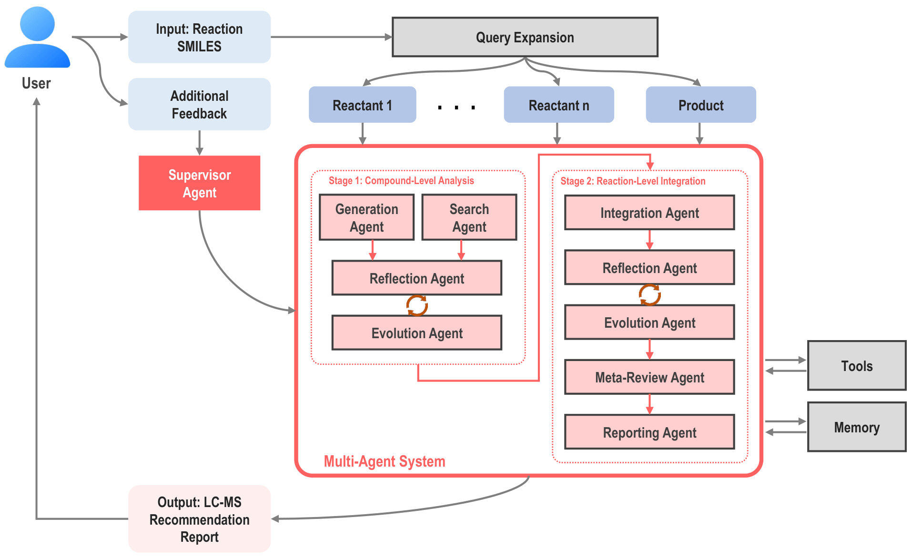
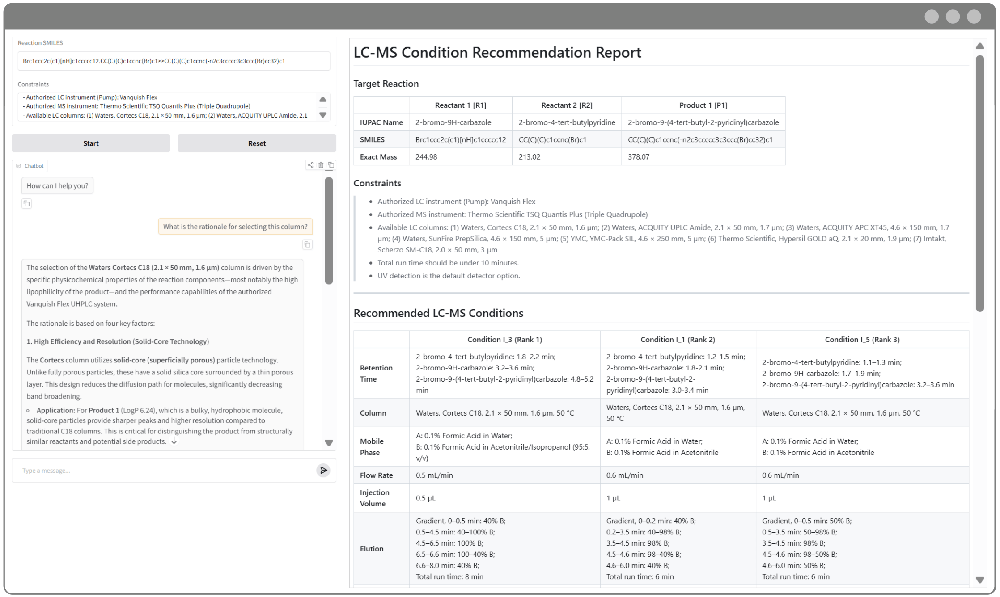

<div align="center">
<h1>
LC–MS Agent: Towards AI-Driven
Recommendation of LC–MS Conditions for
Chemical Reactions
</h1>


Youngchun Kwon†‡ · Hyukju Kwon†‡ · Jinju Park¶ · Youn-Suk Choi*‡ · Seokho Kang*¶
</strong>


<sub>
† Equal contribution &nbsp;&nbsp; 
‡ Samsung Advanced Institute of Technology, Samsung Electronics Co. Ltd., Suwon, Republic of Korea <br/>
¶ Department of Industrial Engineering, Sungkyunkwan University, Suwon, Republic of Korea
</sub>

<br/>

<br/>
<div align="center">


</div>
<div align="left">
<br/>
This repository is the official Pytorch implementation code of our <strong>"LC–MS Agent: Towards AI-Driven
Recommendation of LC–MS Conditions for
Chemical Reactions - Youngchun Kwon, Hyukju Kwon, Jinju Park, Youn-Suk Choi, and Seokho
Kang".</strong> Our LC–MS Agent system is an LLM-based multi-agent framework that automatically recommends reaction-level LC–MS conditions given a chemical reaction and user-defined analytical requirements.

<br/>
<br/>


<div align="center">



</div>


---

## Abstract 

Liquid Chromatography–Mass Spectrometry (LC–MS) is a foundational tool for the identification and monitoring of chemical compounds. However, its application to complex chemical reactions remains challenging, as analytical methods optimized for individual compounds often fail to capture the full scope of a reaction. The difficulty lies in establishing LC–MS conditions that achieve simultaneous detection and chromatographic resolution for multiple reactants and products with diverse physicochemical properties. In this work, we present a large language model (LLM)-based multi-agent system designed to recommend LC–MS conditions for comprehensive chemical reaction analysis. The agent system comprises multiple sub-agents that are context-engineered to be chemistry-aware and to perform specific functional roles that an analytical chemist would perform when determining the LC–MS conditions, emulating the decision-making process of an analytical chemist. Given a chemical reaction and user-defined analytical requirements in natural language, the system autonomously searches relevant literature, reasons over compound properties, and proposes plausible LC–MS conditions that can detect all reaction components within a single analytical run. We demonstrate its effectiveness through a case study on organic electronic materials, confirming that the recommended LC–MS conditions are highly suitable for a diverse set of chemical reactions.

---

## User Interface

The LC–MS Agent provides a web-based interface for interactive reaction analysis and report generation.
The left panel enables conversational interaction with the agent, while the right panel displays the generated LC–MS recommendation report.

<div align="center">



</div>
<br/>
By following the setup instructions below, you can launch the application and access this interface.

---

## Installation

Clone the repository and set up the environment as follows:

```bash
conda create -n lcms_agent python=3.11 -y
conda activate lcms_agent
pip install -r requirements.txt
```

---

## Quick Start

### **Step 1. Set Environment Variables**
Edit the `.env` file in the project root with your API keys (for base LLMs and the search tool):
```
GOOGLE_API_KEY=[your api key here]
TAVILY_API_KEY=[your api key here]
```

The API keys can be obtained from:
- Google Gemini API: https://ai.google.dev/gemini-api
- Tavily: https://www.tavily.com/

(Optional) API keys for scholarly search:
```
GOOGLE_CSE_ID=[your api key here]
ELSEVIER_API_KEY=[your api key here]
TDM_API_TOKEN=[your api key here]
SN_API_KEY=[your api key here]
```

The API keys can be obtained from:
- Google Programmable Search Engine: https://programmablesearchengine.google.com/
- Elsevier TDM API: https://dev.elsevier.com/
- Wiley TDM API: https://onlinelibrary.wiley.com/library-info/resources/text-and-datamining
- SpringerNautre TDM API: https://www.springernature.com/gp/researchers/text-and-data-mining

For the Google Programmable Search Engine to search articles from the selected publishers,
you need to create a custom search engine and include the following as **"Sites to search"** in the **Search Features** setting:
- Elsevier: `sciencedirect.com/science/article/*`
- Wiley: `*.onlinelibrary.wiley.com/doi/*`
- Springer: `link.springer.com/article/*`
- Nature: `nature.com/articles/*`

---

### **Step 2. Set Configurations**

Modify `config.yaml` to adjust LLM settings and agent options.

---

### **Step 3. Run the Application**

```bash
python app.py
```

You can then:

- Input a chemical reaction  
- Specify analytical requirements  
- Generate LC–MS condition recommendations  

### **Step 4. View the Generated Report**

- The report will be displayed in the UI  
- A copy will be saved in the `reports/` directory  


## Project Structure

```
lm_lc_agent/
├── agents/
├── data/
├── downloads/
├── figs/
│   └── framework.png
│   └── report.png
├── reports/
├── .env
├── agents.py
├── app.py
├── chem_utils.py
├── config.yaml
├── doc_utils.py
├── graph.py
├── procedure.py
├── prompt.py
├── README.md
├── requirements.txt
├── tools.py
└── ui.py
```


## Citation
If you think our repo is useful, please cite our paper:

```bibtex
TBU
```


